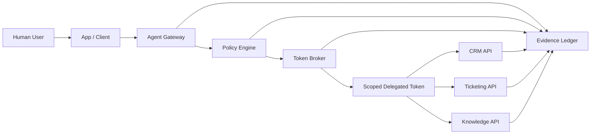

# SecureTheCloud Brokered Agent Delegation Lab

> Cross-App Access & Brokered Delegation for AI Agents

This lab demonstrates how to let an AI agent perform work across enterprise applications without giving the agent broad standing privileges or independent superuser power.

The core design principle is simple:

> **The agent must never have more power than the human user who triggered it.**

The lab models a secure brokered delegation pattern using:

- User-bound delegation
- OAuth 2.0 Token Exchange concepts
- Agent gateway enforcement
- Policy-as-code authorization
- Audience-bound and scope-limited delegated tokens
- Mock enterprise APIs
- Evidence records for every allow/deny decision
- Abuse-case validation for prompt injection, scope escalation, wrong-audience token use, and unauthorized cross-app access

---

## Current Build Status

| Phase | Status | Capability |
|---|---|---|
| Phase 0 | Complete | Source of Truth, architecture, threat model, policy/evidence contract, infographic |
| Phase 1 | Complete | Deterministic policy decision loop with pytest validation |
| Phase 2 | Implemented | Mock token broker issues structured delegated tokens after policy approval |
| Phase 3 | Next | Mock enterprise APIs validate audience, scope, and expiration |

Validated locally so far:

```text
7 passed in 0.09s
```

After Phase 2, the expected test count increases because token broker tests are now included.

---

## Why This Lab Matters

Enterprise AI agents are increasingly expected to act across SaaS, internal APIs, ticketing systems, CRM platforms, knowledge systems, identity systems, and data platforms.

The risky pattern is this:

```text
Agent -> Admin API token -> Everything
```

This lab demonstrates the safer pattern:

```text
Human User -> Agent Gateway -> Policy Engine -> Token Broker -> Scoped Delegated Token -> Target Enterprise API
```

The agent receives only the downstream access required for the approved task. Access is constrained by the human user's identity, the target app, requested action, agent capability, policy decision, token audience, token lifetime, and evidence requirements.

---

## Capability Infographic

A repo-native SVG infographic is available here:

- [`docs/assets/brokered-agent-delegation-infographic.svg`](docs/assets/brokered-agent-delegation-infographic.svg)

The infographic summarizes the lab capability model, architecture flow, security guarantees, abuse scenarios, and deliverables.

---

## Core Architecture



---

## Phase 2 Token Broker

Phase 2 adds a mock token broker that simulates an OAuth-style delegated token exchange.

The broker follows this rule:

```text
No policy approval -> no delegated token.
```

Allowed requests produce a structured token claim set with:

```json
{
  "iss": "securethecloud-token-broker",
  "sub": "alice@example.com",
  "act": {
    "sub": "support-agent-001"
  },
  "aud": "ticketing-api",
  "scope": "ticket:create",
  "delegation_type": "on_behalf_of",
  "iat": 1893456700,
  "exp": 1893457000,
  "jti": "unique-token-id"
}
```

Important: the lab stores token metadata in evidence, not raw bearer tokens.

### Phase 2 files

```text
src/brokered_delegation/models.py
src/brokered_delegation/token_broker.py
tests/test_token_broker.py
samples/requests/allow-ticket-create.json
samples/README.md
```

---

## Security Guarantees

| Guarantee | Meaning |
|---|---|
| User-bound delegation | The agent acts only on behalf of the triggering user. |
| Least privilege | The downstream token contains only the approved scope. |
| Audience-bound access | A token for one API cannot be reused against another API. |
| Scope reduction | The broker cannot request broader authority than the user and policy allow. |
| Deny by default | Unknown users, apps, agents, actions, or scopes are denied. |
| Evidence-first governance | Every decision produces an audit-friendly evidence record. |

---

## Primary Lab Scenario

A support user asks an agent to check customer status and create a support ticket.

The agent needs to access:

1. `crm-api` to read customer/account information.
2. `ticketing-api` to create a support ticket.
3. `knowledge-api` to retrieve approved support runbooks.

The agent must not access:

- HR salary data
- Billing mutation APIs
- Admin APIs
- Any target app using a token with the wrong audience
- Any action outside the user's permissions or the agent's capability manifest

---

## Abuse and Defense Scenarios

| Scenario | Expected Result |
|---|---|
| Prompt injection asks the agent to read HR data | `DENY` |
| Agent asks for broader scope than the user has | `DENY` |
| User has permission and agent has capability to create a ticket | `ALLOW` |
| CRM token is reused against Ticketing API | `DENY` |
| User has permission but agent lacks capability | `DENY` |
| Agent has capability but user lacks permission | `DENY` |
| Expired delegated token is reused | `DENY` |

---

## Repository Structure

```text
.
├── README.md
├── docs/
│   ├── 00-sot.md
│   ├── 01-architecture.md
│   ├── 02-threat-model.md
│   ├── 03-token-exchange-flow.md
│   ├── 04-agent-capability-model.md
│   ├── 05-policy-decision-model.md
│   ├── 06-evidence-model.md
│   ├── 07-build-roadmap.md
│   └── assets/
│       └── brokered-agent-delegation-infographic.svg
├── config/
│   ├── agents.yaml
│   ├── apps.yaml
│   ├── scopes.yaml
│   └── users.yaml
├── policies/
│   ├── agent_capabilities.rego
│   ├── data_classification.rego
│   └── delegated_access.rego
├── samples/
│   ├── README.md
│   └── requests/
│       └── allow-ticket-create.json
├── services/
│   └── README.md
├── src/
│   └── brokered_delegation/
│       ├── __init__.py
│       ├── config_loader.py
│       ├── models.py
│       ├── policy_engine.py
│       └── token_broker.py
├── evidence/
│   ├── evidence-schema.json
│   ├── sample-allow-record.json
│   └── sample-deny-record.json
└── tests/
    ├── test_plan.md
    ├── test_policy_engine.py
    └── test_token_broker.py
```

---

## Build Phases

### Phase 0 — Source of Truth and Architecture

- Define the lab goal.
- Document the architecture.
- Define the threat model.
- Define policy, config, and evidence schemas.
- Add repo-native infographic.

### Phase 1 — Deterministic Policy Simulation

- Implement policy checks for user, agent, action, target app, scope, and data classification.
- Generate allow/deny evidence records.
- Validate abuse cases without live external identity integration.

### Phase 2 — Mock Token Broker

- Simulate token exchange.
- Issue mock delegated tokens with `sub`, `act`, `aud`, `scope`, `exp`, and `jti` claims.
- Deny token minting when policy denies the action.
- Preserve token metadata in evidence without logging raw bearer tokens.

### Phase 3 — Mock Enterprise APIs

- Add CRM, Ticketing, and Knowledge mock APIs.
- Validate token audience and scope at each API.
- Prove wrong-audience and over-scope calls fail.

### Phase 4 — Okta / External IdP Integration Path

- Add optional Okta/OIDC setup documentation.
- Add external token validation path.
- Map user claims and groups to lab permissions.

### Phase 5 — Advanced Enterprise Controls

- Add sender-constrained token pattern notes.
- Add rich authorization request model.
- Add risk-tier-aware delegation.
- Add dashboard/evidence export.

---

## Quick Start

Clone the repo:

```bash
git clone https://github.com/S3curethecloud/SecureTheCloud-Brokered-Agent-Delegation-Lab.git
cd SecureTheCloud-Brokered-Agent-Delegation-Lab
```

Create and activate a virtual environment:

```bash
python -m venv .venv
source .venv/bin/activate
```

Install and validate:

```bash
make install
make validate
```

Run pytest directly:

```bash
pytest -q
```

Review the Source of Truth:

```bash
cat docs/00-sot.md
```

Review the capability model:

```bash
cat config/agents.yaml
cat config/apps.yaml
cat config/users.yaml
```

---

## Portfolio Positioning

Use this lab to demonstrate enterprise-grade thinking across:

- IAM and identity security architecture
- OAuth/OIDC delegation patterns
- Secure AI agent design
- Cross-app access governance
- Policy-as-code
- AI governance evidence
- Least-privilege enterprise automation

Interview summary:

> I built this lab to show how AI agents can act across enterprise systems without becoming overprivileged service accounts. The design uses a brokered delegation pattern where every action is bound to the triggering user, the agent capability manifest, the target application, the requested scope, and a policy decision. The agent receives only a short-lived, audience-bound delegated token, and every allow or deny decision is recorded as evidence.
