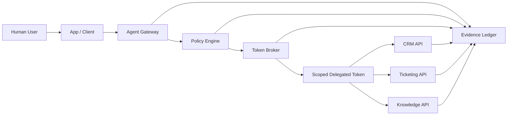

# SecureTheCloud Brokered Agent Delegation Lab

> Cross-App Access & Brokered Delegation for AI Agents

This lab demonstrates how to let an AI agent perform work across enterprise applications without giving the agent broad standing privileges or independent superuser power.

The core design principle is simple:

> **The agent must never have more power than the human user who triggered it.**

The lab models a secure brokered delegation pattern using:

- User-bound delegation
- OAuth 2.0 Token Exchange concepts
- Agent gateway enforcement
- Policy-as-code authorization
- Audience-bound and scope-limited delegated tokens
- Mock enterprise API enforcement
- Evidence records for every allow/deny decision
- Abuse-case validation for prompt injection, scope escalation, wrong-audience token use, expired token reuse, and unauthorized cross-app access

---

## Current Build Status

| Phase | Status | Capability |
|---|---|---|
| Phase 0 | Complete | Source of Truth, architecture, threat model, policy/evidence contract, infographic |
| Phase 1 | Complete | Deterministic policy decision loop with pytest validation |
| Phase 2 | Complete | Mock token broker issues structured delegated tokens after policy approval |
| Phase 3 | Complete | Mock enterprise APIs independently validate audience, scope, expiration, and delegation context |
| Phase 4A | Complete | Local demo runner writes full-chain evidence JSON artifacts |
| Phase 4A.1 | Complete | Evidence review CLI turns latest JSON evidence into a clean demo summary |
| Phase 4B | Implemented | Documentation-first Okta/OIDC integration planning gate |
| Phase 5 | Next | Future external-token validation code and enterprise hardening implementation |

Expected validation after Phase 4B remains:

```text
27 passed
```

Phase 4B is documentation-only by design. It does not introduce tenant-specific values, secrets, or live IdP calls.

---

## Why This Lab Matters

Enterprise AI agents are increasingly expected to act across SaaS, internal APIs, ticketing systems, CRM platforms, knowledge systems, identity systems, and data platforms.

The risky pattern is this:

```text
Agent -> Admin API token -> Everything
```

This lab demonstrates the safer pattern:

```text
Human User -> Agent Gateway -> Policy Engine -> Token Broker -> Scoped Delegated Token -> Target Enterprise API -> Evidence
```

The agent receives only the downstream access required for the approved task. Access is constrained by the human user's identity, the target app, requested action, agent capability, policy decision, token audience, token lifetime, downstream API validation, and evidence requirements.

---

## Capability Infographic

A repo-native SVG infographic is available here:

- [`docs/assets/brokered-agent-delegation-infographic.svg`](docs/assets/brokered-agent-delegation-infographic.svg)

---

## Core Architecture



---

## Live Demo Flow

Run validation:

```bash
make validate
```

Generate a full-chain evidence file:

```bash
make demo
```

Review the latest evidence summary:

```bash
make evidence
```

Or run the scripts directly:

```bash
python scripts/run_demo.py samples/requests/allow-ticket-create.json
python scripts/show_latest_evidence.py
```

Expected evidence summary:

```text
SecureTheCloud Brokered Delegation Evidence Summary
========================================================
Request: sample-allow-ticket-create
Policy: ALLOW
Token Exchange: SUCCESS
API Decision: ALLOW
API Access: SUCCESS
User: alice@example.com
Agent: support-agent-001
Target App: ticketing-api
Scope: ticket:create
Token Audience: ticketing-api
API Reason: API_ACCESS_GRANTED
Raw Token Logged: false
Evidence File: evidence/runs/sample-allow-ticket-create-<run-id>.json
```

See:

- [`docs/09-local-demo-runner.md`](docs/09-local-demo-runner.md)
- [`docs/10-demo-walkthrough.md`](docs/10-demo-walkthrough.md)

---

## Phase 4B: Okta / OIDC Integration Planning Gate

Phase 4B maps the local proof to an external identity provider path without adding secrets or live tenant configuration.

The planning gate includes:

- [`docs/11-okta-oidc-integration-plan.md`](docs/11-okta-oidc-integration-plan.md)
- [`docs/12-oauth-token-exchange-mapping.md`](docs/12-oauth-token-exchange-mapping.md)
- [`docs/13-production-hardening-checklist.md`](docs/13-production-hardening-checklist.md)

The integration stance is:

```text
Local deterministic proof first, external IdP integration second.
```

This keeps the project security-first. The current local controls remain the source of truth before introducing a real authorization server, tenant-specific issuer, JWKS validation, external token exchange, or production API credentials.

---

## Phase 1: Policy Engine

Phase 1 implements the deterministic authorization loop:

```text
request -> policy evaluation -> allow/deny decision -> evidence output
```

The policy engine checks:

- User exists
- Agent exists and is enabled
- Target app exists
- Requested scope exists
- User has requested scope
- Agent has requested capability
- Target app accepts requested scope/action
- User and agent are allowed for the data classification
- Risk tier does not exceed user or agent limit

---

## Phase 2: Token Broker

Phase 2 adds a mock token broker that simulates an OAuth-style delegated token exchange.

The broker follows this rule:

```text
No policy approval -> no delegated token.
```

Allowed requests produce a structured token claim set:

```json
{
  "iss": "securethecloud-token-broker",
  "sub": "alice@example.com",
  "act": {
    "sub": "support-agent-001"
  },
  "aud": "ticketing-api",
  "scope": "ticket:create",
  "delegation_type": "on_behalf_of",
  "iat": 1893456700,
  "exp": 1893457000,
  "jti": "unique-token-id"
}
```

Important: the lab stores token metadata in evidence, not raw bearer tokens.

---

## Phase 3: Mock Enterprise API Enforcement

Phase 3 proves that downstream enterprise APIs independently validate delegated tokens.

The enterprise API layer checks:

- Token exists
- Token is not expired
- Token audience matches the API
- Token includes the required scope
- Token includes human user context through `sub`
- Token includes acting agent context through `act.sub`
- Raw token material is not logged

Implemented API wrappers:

| API | Required Audience | Required Scope | Function |
|---|---|---|---|
| CRM API | `crm-api` | `customer:read` | `call_crm_api` |
| Ticketing API | `ticketing-api` | `ticket:create` | `call_ticketing_api` |
| Knowledge API | `knowledge-api` | `runbook:read` | `call_knowledge_api` |

---

## Security Guarantees

| Guarantee | Meaning |
|---|---|
| User-bound delegation | The agent acts only on behalf of the triggering user. |
| Least privilege | The downstream token contains only the approved scope. |
| Audience-bound access | A token for one API cannot be reused against another API. |
| Scope reduction | The broker cannot request broader authority than the user and policy allow. |
| Deny by default | Unknown users, apps, agents, actions, scopes, and APIs are denied. |
| Evidence-first governance | Every decision produces an audit-friendly evidence record. |
| API-side enforcement | Downstream systems independently validate token claims. |
| Demo evidence | A full local run writes a reviewable JSON artifact. |
| Evidence review | The latest evidence can be summarized for live demos. |
| Integration gate | External IdP integration is planned before live configuration is introduced. |

---

## Abuse and Defense Scenarios

| Scenario | Expected Result |
|---|---|
| Prompt injection asks the agent to read restricted data | `DENY` |
| Agent asks for broader scope than the user has | `DENY` |
| User has permission and agent has capability to create a ticket | `ALLOW` |
| Knowledge token is reused against Ticketing API | `DENY` |
| Ticketing token is reused against Knowledge API | `DENY` |
| Token is expired | `DENY` |
| Token lacks required scope | `DENY` |
| Token lacks `act.sub` delegation context | `DENY` |

---

## Repository Structure

```text
.
├── README.md
├── docs/
│   ├── 00-sot.md
│   ├── 01-architecture.md
│   ├── 02-threat-model.md
│   ├── 03-token-exchange-flow.md
│   ├── 04-agent-capability-model.md
│   ├── 05-policy-decision-model.md
│   ├── 06-evidence-model.md
│   ├── 07-build-roadmap.md
│   ├── 08-mock-enterprise-apis.md
│   ├── 09-local-demo-runner.md
│   ├── 10-demo-walkthrough.md
│   ├── 11-okta-oidc-integration-plan.md
│   ├── 12-oauth-token-exchange-mapping.md
│   ├── 13-production-hardening-checklist.md
│   └── assets/
│       └── brokered-agent-delegation-infographic.svg
├── config/
│   ├── agents.yaml
│   ├── apps.yaml
│   ├── scopes.yaml
│   └── users.yaml
├── evidence/
│   ├── evidence-schema.json
│   ├── runs/
│   │   └── .gitkeep
│   ├── sample-allow-record.json
│   └── sample-deny-record.json
├── policies/
│   ├── agent_capabilities.rego
│   ├── data_classification.rego
│   └── delegated_access.rego
├── samples/
│   ├── README.md
│   └── requests/
│       ├── allow-runbook-read.json
│       └── allow-ticket-create.json
├── scripts/
│   ├── run_demo.py
│   └── show_latest_evidence.py
├── services/
│   └── README.md
├── src/
│   └── brokered_delegation/
│       ├── __init__.py
│       ├── config_loader.py
│       ├── demo_runner.py
│       ├── enterprise_api.py
│       ├── evidence_review.py
│       ├── models.py
│       ├── policy_engine.py
│       └── token_broker.py
└── tests/
    ├── test_demo_runner.py
    ├── test_enterprise_api.py
    ├── test_evidence_review.py
    ├── test_plan.md
    ├── test_policy_engine.py
    └── test_token_broker.py
```

---

## Build Phases

### Phase 0 — Source of Truth and Architecture

Complete.

### Phase 1 — Deterministic Policy Simulation

Complete.

### Phase 2 — Mock Token Broker

Complete.

### Phase 3 — Mock Enterprise APIs

Complete.

### Phase 4A — Local Demo Runner and Evidence Output

Complete.

### Phase 4A.1 — Evidence Review CLI and Demo Summary

Complete.

### Phase 4B — Okta / External IdP Integration Planning Gate

Implemented.

### Phase 5 — External Token Validation and Enterprise Hardening

Next:

- Add external JWT/OIDC validation code.
- Add claim-to-policy identity mapping.
- Add optional external token exchange broker interface.
- Keep secrets and tenant-specific values out of Git.

---

## Quick Start

Clone the repo:

```bash
git clone https://github.com/S3curethecloud/SecureTheCloud-Brokered-Agent-Delegation-Lab.git
cd SecureTheCloud-Brokered-Agent-Delegation-Lab
```

Create and activate a virtual environment:

```bash
python -m venv .venv
source .venv/bin/activate
```

Install and validate:

```bash
make install
make validate
```

Run the local evidence demo and summary:

```bash
make demo
make evidence
```

Review the integration planning gate:

```bash
cat docs/11-okta-oidc-integration-plan.md
cat docs/12-oauth-token-exchange-mapping.md
cat docs/13-production-hardening-checklist.md
```

---

## Portfolio Positioning

Use this lab to demonstrate enterprise-grade thinking across:

- IAM and identity security architecture
- OAuth/OIDC delegation patterns
- Secure AI agent design
- Cross-app access governance
- Policy-as-code
- API-side authorization enforcement
- AI governance evidence
- Least-privilege enterprise automation

Interview summary:

> I built this lab to show how AI agents can act across enterprise systems without becoming overprivileged service accounts. The design uses a brokered delegation pattern where every action is bound to the triggering user, the agent capability manifest, the target application, the requested scope, and a policy decision. The agent receives only a short-lived, audience-bound delegated token, and each downstream API independently validates audience, scope, expiration, and delegation context before access is granted. The local demo runner produces audit-ready evidence for the full chain, the evidence review CLI turns that artifact into a clean live-demo summary, and the Okta/OIDC planning gate maps the local proof to external identity integration without introducing secrets too early.
