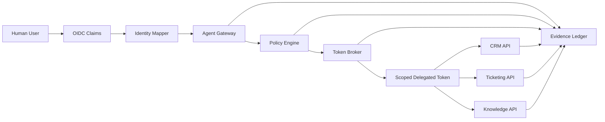

# SecureTheCloud Brokered Agent Delegation Lab

> Cross-App Access & Brokered Delegation for AI Agents

This lab demonstrates how to let an AI agent perform work across enterprise applications without giving the agent broad standing privileges or independent superuser power.

The core design principle is simple:

> **The agent must never have more power than the human user who triggered it.**

The lab models a secure brokered delegation pattern using:

- User-bound delegation
- OAuth 2.0 Token Exchange concepts
- Agent gateway enforcement
- Policy-as-code authorization
- Audience-bound and scope-limited delegated tokens
- Mock enterprise API enforcement
- External OIDC claim validation simulation
- Evidence records for every allow/deny decision
- Abuse-case validation for prompt injection, scope escalation, wrong-audience token use, expired token reuse, and unauthorized cross-app access

---

## Current Build Status

| Phase | Status | Capability |
|---|---|---|
| Phase 0 | Complete | Source of Truth, architecture, threat model, policy/evidence contract, infographic |
| Phase 1 | Complete | Deterministic policy decision loop with pytest validation |
| Phase 2 | Complete | Mock token broker issues structured delegated tokens after policy approval |
| Phase 3 | Complete | Mock enterprise APIs independently validate audience, scope, expiration, and delegation context |
| Phase 4A | Complete | Local demo runner writes full-chain evidence JSON artifacts |
| Phase 4A.1 | Complete | Evidence review CLI turns latest JSON evidence into a clean demo summary |
| Phase 4B | Complete | Documentation-first Okta/OIDC integration planning gate |
| Phase 5A | Implemented | Non-secret OIDC claim validation and identity-to-policy mapping simulation |
| Phase 5B | Next | External token validator interface and future JWKS-ready boundary |

Expected validation after Phase 5A:

```text
43 passed
```

Phase 5A still does not introduce a live Okta tenant, client secrets, tenant-specific issuer values, or raw tokens.

---

## Why This Lab Matters

Enterprise AI agents are increasingly expected to act across SaaS, internal APIs, ticketing systems, CRM platforms, knowledge systems, identity systems, and data platforms.

The risky pattern is this:

```text
Agent -> Admin API token -> Everything
```

This lab demonstrates the safer pattern:

```text
Human User -> Validated Identity Claims -> Agent Gateway -> Policy Engine -> Token Broker -> Scoped Delegated Token -> Target Enterprise API -> Evidence
```

The agent receives only the downstream access required for the approved task. Access is constrained by the human user's identity, the target app, requested action, agent capability, policy decision, token audience, token lifetime, downstream API validation, external identity mapping, and evidence requirements.

---

## Live Demo Flow

Run validation:

```bash
make validate
```

Generate a full-chain evidence file:

```bash
make demo
```

Review the latest evidence summary:

```bash
make evidence
```

Or run the scripts directly:

```bash
python scripts/run_demo.py samples/requests/allow-ticket-create.json
python scripts/show_latest_evidence.py
```

---

## Phase 5A: External Claims Validation Simulation

Phase 5A adds deterministic validation for non-secret OIDC-style claims.

The simulation flow is:

```text
sample OIDC claims
  -> validate issuer/audience/exp/sub
  -> map groups/scopes to local user policy context
  -> feed existing policy engine
  -> preserve fail-closed behavior
```

Added files:

```text
src/brokered_delegation/oidc_claims.py
src/brokered_delegation/identity_mapper.py
samples/oidc/sample-access-token-claims.json
samples/oidc/sample-invalid-token-claims.json
tests/test_oidc_claims.py
tests/test_identity_mapper.py
docs/14-external-claims-validation.md
```

Important security invariant:

```text
Validated identity is not authorization.
Authorization remains policy-driven.
```

The OIDC simulation validates:

- trusted issuer
- expected audience
- subject presence
- expiration
- issued-at timestamp
- groups
- scopes

The identity mapper then maps external claims into the existing local policy model. It does not create a second authorization path.

See:

- [`docs/14-external-claims-validation.md`](docs/14-external-claims-validation.md)

---

## Phase 4B: Okta / OIDC Integration Planning Gate

Phase 4B maps the local proof to an external identity provider path without adding secrets or live tenant configuration.

The planning gate includes:

- [`docs/11-okta-oidc-integration-plan.md`](docs/11-okta-oidc-integration-plan.md)
- [`docs/12-oauth-token-exchange-mapping.md`](docs/12-oauth-token-exchange-mapping.md)
- [`docs/13-production-hardening-checklist.md`](docs/13-production-hardening-checklist.md)

The integration stance is:

```text
Local deterministic proof first, external IdP integration second.
```

---

## Core Architecture



---

## Security Guarantees

| Guarantee | Meaning |
|---|---|
| User-bound delegation | The agent acts only on behalf of the triggering user. |
| Least privilege | The downstream token contains only the approved scope. |
| Audience-bound access | A token for one API cannot be reused against another API. |
| Scope reduction | The broker cannot request broader authority than the user and policy allow. |
| Deny by default | Unknown users, apps, agents, actions, scopes, APIs, groups, and issuers are denied. |
| Evidence-first governance | Every decision produces an audit-friendly evidence record. |
| API-side enforcement | Downstream systems independently validate token claims. |
| Demo evidence | A full local run writes a reviewable JSON artifact. |
| Evidence review | The latest evidence can be summarized for live demos. |
| Integration gate | External IdP integration is planned before live configuration is introduced. |
| Identity-not-authorization | Valid external claims still require policy approval. |

---

## Repository Structure

```text
.
├── README.md
├── docs/
│   ├── 00-sot.md
│   ├── 01-architecture.md
│   ├── 02-threat-model.md
│   ├── 03-token-exchange-flow.md
│   ├── 04-agent-capability-model.md
│   ├── 05-policy-decision-model.md
│   ├── 06-evidence-model.md
│   ├── 07-build-roadmap.md
│   ├── 08-mock-enterprise-apis.md
│   ├── 09-local-demo-runner.md
│   ├── 10-demo-walkthrough.md
│   ├── 11-okta-oidc-integration-plan.md
│   ├── 12-oauth-token-exchange-mapping.md
│   ├── 13-production-hardening-checklist.md
│   ├── 14-external-claims-validation.md
│   └── assets/
│       └── brokered-agent-delegation-infographic.svg
├── config/
│   ├── agents.yaml
│   ├── apps.yaml
│   ├── scopes.yaml
│   └── users.yaml
├── evidence/
│   ├── evidence-schema.json
│   ├── runs/
│   │   └── .gitkeep
│   ├── sample-allow-record.json
│   └── sample-deny-record.json
├── policies/
│   ├── agent_capabilities.rego
│   ├── data_classification.rego
│   └── delegated_access.rego
├── samples/
│   ├── oidc/
│   │   ├── sample-access-token-claims.json
│   │   └── sample-invalid-token-claims.json
│   ├── README.md
│   └── requests/
│       ├── allow-runbook-read.json
│       └── allow-ticket-create.json
├── scripts/
│   ├── run_demo.py
│   └── show_latest_evidence.py
├── services/
│   └── README.md
├── src/
│   └── brokered_delegation/
│       ├── __init__.py
│       ├── config_loader.py
│       ├── demo_runner.py
│       ├── enterprise_api.py
│       ├── evidence_review.py
│       ├── identity_mapper.py
│       ├── models.py
│       ├── oidc_claims.py
│       ├── policy_engine.py
│       └── token_broker.py
└── tests/
    ├── test_demo_runner.py
    ├── test_enterprise_api.py
    ├── test_evidence_review.py
    ├── test_identity_mapper.py
    ├── test_oidc_claims.py
    ├── test_plan.md
    ├── test_policy_engine.py
    └── test_token_broker.py
```

---

## Quick Start

Clone the repo:

```bash
git clone https://github.com/S3curethecloud/SecureTheCloud-Brokered-Agent-Delegation-Lab.git
cd SecureTheCloud-Brokered-Agent-Delegation-Lab
```

Create and activate a virtual environment:

```bash
python -m venv .venv
source .venv/bin/activate
```

Install and validate:

```bash
make install
make validate
```

Run the local evidence demo and summary:

```bash
make demo
make evidence
```

Review the external claims validation doc:

```bash
cat docs/14-external-claims-validation.md
```

---

## Portfolio Positioning

Use this lab to demonstrate enterprise-grade thinking across:

- IAM and identity security architecture
- OAuth/OIDC delegation patterns
- Secure AI agent design
- Cross-app access governance
- Policy-as-code
- API-side authorization enforcement
- External identity claim mapping
- AI governance evidence
- Least-privilege enterprise automation

Interview summary:

> I built this lab to show how AI agents can act across enterprise systems without becoming overprivileged service accounts. The design uses a brokered delegation pattern where every action is bound to the triggering user, the agent capability manifest, the target application, the requested scope, and a policy decision. The agent receives only a short-lived, audience-bound delegated token, and each downstream API independently validates audience, scope, expiration, and delegation context before access is granted. The local demo runner produces audit-ready evidence for the full chain, the evidence review CLI turns that artifact into a clean live-demo summary, and the external claims simulation proves that validated identity is still not authorization until policy allows the action.
