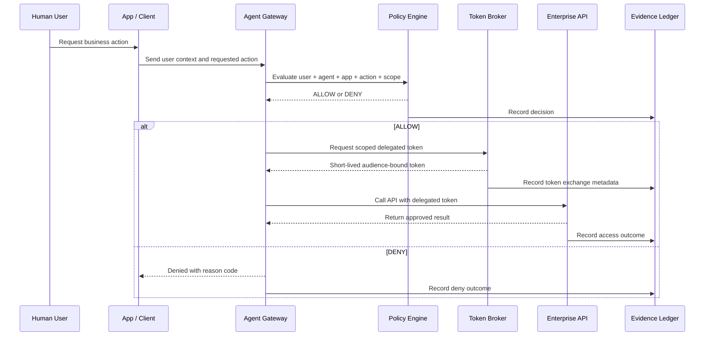

# Architecture Overview

## Design Goal

The architecture separates user authentication, agent routing, authorization policy, delegated token issuance, downstream API access, and evidence recording.

This separation is intentional. It prevents the agent runtime from becoming the security boundary.

## Logical Components

| Component | Responsibility |
|---|---|
| App / Client | Captures the user's request and presents the user's identity context. |
| Agent Gateway | Entry point for agent-mediated actions. Normalizes the requested tool/action. |
| Policy Engine | Decides whether the user, agent, target app, scope, and data class are allowed. |
| Token Broker | Issues or simulates short-lived delegated tokens only after policy approval. |
| Enterprise APIs | Mock CRM, Ticketing, and Knowledge systems that validate audience and scope. |
| Evidence Ledger | Records policy decisions, token exchange results, and API access outcomes. |

## Architecture Flow



## Trust Boundaries

```text
[User Browser / CLI]
        |
        | user token / request context
        v
[Agent Gateway Boundary]
        |
        | normalized authorization request
        v
[Policy + Token Broker Boundary]
        |
        | delegated token
        v
[Enterprise API Boundary]
```

## Important Architectural Rule

The agent does not decide its own permissions.

The policy engine and token broker define what the agent is allowed to do, and the enterprise API independently validates the token before serving the request.

## Delegated Token Claim Model

A delegated token should contain these logical claims:

```json
{
  "iss": "securethecloud-token-broker",
  "sub": "alice@example.com",
  "act": {
    "sub": "support-agent-001"
  },
  "aud": "ticketing-api",
  "scope": "ticket:create",
  "delegation_type": "on_behalf_of",
  "exp": 1893456000,
  "jti": "token-instance-id"
}
```

## Defense-in-Depth

The architecture uses multiple enforcement points:

1. Agent gateway validates request shape and known agent/tool mapping.
2. Policy engine validates authorization context.
3. Token broker refuses to mint tokens for denied requests.
4. Enterprise API validates audience and scope.
5. Evidence ledger records every outcome.

## Future Production Mapping

In a real enterprise design, the lab pattern can map to:

- Okta or another IdP as the identity provider.
- OAuth 2.0 Token Exchange or On-Behalf-Of style delegation.
- API gateway or service mesh as the downstream enforcement layer.
- OPA, Cedar, Sentinel, or custom ABAC/RBAC service as policy engine.
- SIEM, data lake, or GRC evidence store as audit sink.
